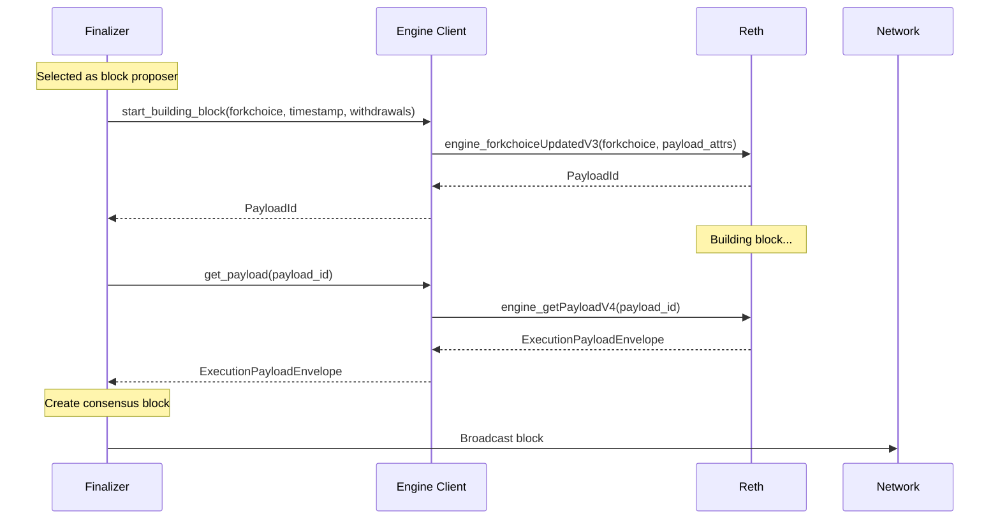
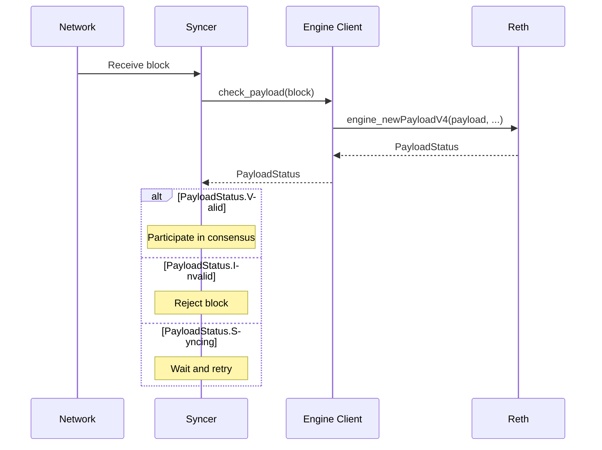
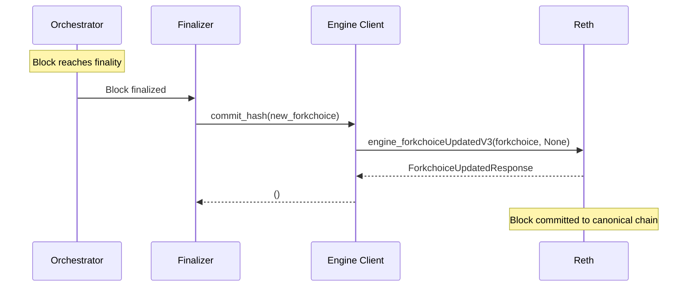

# Engine API Integration

Summit communicates with execution clients (e.g. reth) exclusively through the Engine API. This document details the integration patterns, communication flows, and security considerations for this critical interface.

## Engine API Overview

The Engine API is the standard interface between consensus and execution layers in Ethereum-like systems. Summit acts as the consensus client, while reth handles transaction execution and state management.

```
┌─────────────────┐    Engine API     ┌─────────────────┐
│                 │  ←─────────────→  │                 │
│     Summit      │       (IPC)       │    Reth/Geth    │
│   (Consensus)   │                   │   (Execution)   │
│                 │                   │                 │
└─────────────────┘                   └─────────────────┘
```

## Engine Client Implementation

### Core Interface (`types/src/engine_client.rs`)

Summit defines a generic `EngineClient` trait that abstracts execution client communication:

```rust
pub trait EngineClient: Clone + Send + Sync + 'static {
    fn start_building_block(
        &self,
        fork_choice_state: ForkchoiceState,
        timestamp: u64,
        withdrawals: Vec<Withdrawal>,
    ) -> impl Future<Output = Option<PayloadId>> + Send;

    fn get_payload(
        &self,
        payload_id: PayloadId,
    ) -> impl Future<Output = ExecutionPayloadEnvelopeV4> + Send;

    fn check_payload<C: Signer, V: Variant>(
        &self,
        block: &Block<C, V>,
    ) -> impl Future<Output = PayloadStatus> + Send;

    fn commit_hash(
        &self, 
        fork_choice_state: ForkchoiceState
    ) -> impl Future<Output = ()> + Send;
}
```

### Reth Implementation

The `RethEngineClient` implements the trait using Alloy's Engine API client:

```rust
#[derive(Clone)]
pub struct RethEngineClient {
    provider: RootProvider,
}
```

**Connection Details:**
- **Transport**: IPC socket (default: `/tmp/reth_engine_api.ipc`)
- **Protocol**: JSON-RPC over IPC
- **Persistence**: Long-lived connection with reconnection logic

## Engine API Methods

### 1. `engine_forkchoiceUpdatedV3`

Updates the execution client's view of the canonical chain and optionally starts building a new block.

### 2. `engine_getPayloadV4`

Retrieves a built block from the execution client. Called shortly after start_building block

### 3. `engine_newPayloadV4`

Validates and stores a block without committing it to the canonical chain. Used when validitating received blocks to verify with execution

## Communication Patterns

### Block Production Flow



### Block Validation Flow



### Finalization Flow



## Error Handling

### Engine API Errors

The Engine API can return several types of errors that Summit must handle. These include:

1. **Invalid State**: Execution client rejects forkchoice update
   - **Cause**: Invalid block hash or inconsistent state
   - **Handling**: Log error and continue with current state

2. **Syncing State**: Execution client is syncing
   - **Cause**: Client behind or processing large state changes
   - **Handling**: Wait and retry operation

3. **Connection Errors**: IPC/network issues
   - **Cause**: Socket errors, timeouts, or client restarts
   - **Handling**: Reconnect and retry with backoff

## Security Considerations

### Authentication

Engine API communication is secured using a unix socket inside the secure VM. We feel this is safer then using http secured with a JWT. We use `alloy` for this:

```rust
let provider = ProviderBuilder::default().connect_ipc(ipc).await?;
```

## Monitoring and Observability

**Metrics**: Summit uses Prometheus to collect metrics (enabled with `feature = "prom"`)

**Logging**: Summit uses the `tracing` crate for logging

**Health Checks**: Summit exposes an HTTP API bound to port 3030 by default. This API includes the method `GET /health` which will reply with `"OK"` if you are lucky. While this API is fairly minimal at the time of this writing, we would not be surprised this bloats up in the future
